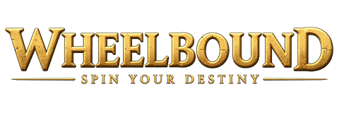

  

Not sure what to do next in Old School RuneScape? Let the wheel choose.

Wheelbound is a RuneLite activity randomizer. Pick a wheel, tailor the choices to
what you feel like doing, and spin for your next adventure.

## Choose your next activity

| Wheel | What to expect |
| --- | --- |
| **Bossing** | Find your next boss or raid, with difficulty, skill-level and access filters. |
| **Skilling** | Choose a skill to train, with an optional second spin for an XP target. |
| **Combat Achievements** | Pick an encounter with unfinished tasks in your selected tiers. Enable **Pick a specific achievement** to show a random unfinished task and its tier below the boss or monster, respecting your filters. |
| **Pet Hunting** | Choose a pet to chase across bosses, raids, skilling and other activities. Optionally exclude pets you already own. |
| **Questing** | Pick an unfinished quest, with difficulty and eligibility filters. |
| **Custom wheels** | Create your own named wheels for any activities or challenges you have in mind. |

Each wheel has a checklist, so you can leave out choices you don't want. Your
filters and custom lists are saved in your RuneLite settings profile.

## Spin your destiny

Open the Wheelbound sidebar, choose a wheel, and adjust its options. The wheel
opens in the game area; click **SPIN** to reveal your choice. Press **Escape** or
use the close button to dismiss it.

To make your own wheel, select **New custom wheel...**, enter a name, and click
**Create**. Add choices using **New Entry** above the list. You can toggle entries,
remove them with the trash icon, or delete a whole custom wheel after confirming.

Account-based options use your current game progress and may require you to be
logged in. Eligibility filters are a guide; they don't check every supply, item,
or requirement. Pet wheel odds are selection odds, not drop rates.

**Spin somewhere safe:** the game keeps running while the wheel is open, and the
popup captures game controls until you close it.

## About this release

**Version 1.0.0** focuses on activity selection and custom wheels. A structured
Wheelbound challenge mode is planned for a future update. Task completion tracking,
progression, unlocks and enforced challenge rules are not included in this release.

Wheelbound suggests what to do; you play the game yourself. It does not automate
game actions or collect login credentials. It has no dedicated server or analytics;
settings are managed by RuneLite, including any RuneLite configuration syncing.

## Availability and feedback

This release is being prepared for RuneLite Plugin Hub review. It is not yet
advertised as approved or available in the Hub.

Found a problem or have an idea? [Open an issue](https://github.com/TheRealEddieDean/RunlitePLugin-Wheelbound/issues).
For build instructions and technical details, see the [development notes](docs/DEVELOPMENT.md).

Licensed under the [BSD 2-Clause License](LICENSE). Game artwork remains the
property of its respective owners; see [credits](docs/CREDITS.md).
